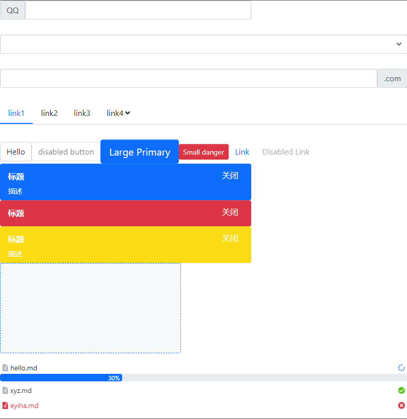

# 项目
React+TypeScript+jest 打造自己的组件库

## 技术栈
- ***React***  : creat-react-app
- ***TypeScript***：静态语言支持
- ***FontAwesome***：图标
- ***transition***：react-transition-group 动画
- ***jest***：testing-library 测试框架
- ***ES6***
- ***SCSS***

## 我学到的
- React+TypeScript 打造组件库的一整套流程， 样式文件组织->开发和文档->组件测试->npm发布。
- 学习了interface定义、泛型使用、React hooks使用、state如何实时获取状态、项目构建发布流程等。
- 一个大型项目不是一蹴而就的，从简单入手，逐步完善需求，渐进式开发。
## 效果

